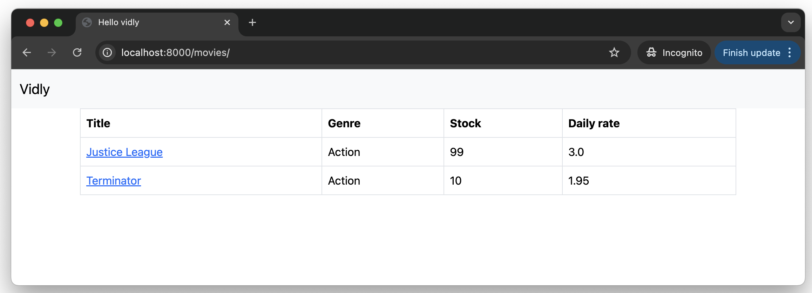

# Sample Django + PostgreSQl App based on Vidly

A simple Django application which reads and writes data to a PostgreSQL database based on [Vidly](https://github.com/amu73/Vidly)

```sh
git clone https://github.com/amu73/Vidly.git
```

## Devfile

This repo contains a [devfile](https://devfile.io/) for use with OpenShift Dev Spaces. Read more in the [guide](docs/dev-spaces.md) to get started with OpenShift Dev Spaces.

## Customisaton

```sh
# Update ./Vidly/vidly/settings.py
# Add localhost host line 28
ALLOWED_HOSTS = ['localhost']

# Add database configuration to line 76-87
DATABASES = {
    'default': {
        'ENGINE': 'django.db.backends.postgresql',
        'NAME': 'db',
        'USER': 'user',
        'PASSWORD': 'password',
        'HOST':'devfile-postgres-sample',
        'PORT':'5432',
    }
}

# Create requirements file
cat << EOF > ./Vidly/requirements.txt
asgiref== 3.8.1
astroid==3.3.4
dill==0.3.9
Django==5.1.1
django-tastypie==0.14.7
gunicorn==23.0.0
isort==5.13.2
lazy-object-proxy==1.10.0
mccabe==0.7.0
packaging==24.1
pep8==1.7.1
pip==23.2.1
platformdirs==4.3.6
psycopg2==2.9.9
pylint==3.3.1
pylint-django==2.5.5
pylint-plugin-utils==0.8.2
python-dateutil==2.9.0.post0
python-mimeparse==2.0.0
pytz==2024.2
six==1.16.0
sqlparse==0.5.1
toml==0.10.2
tomlkit==0.13.2
whitenoise==6.7.0
wrapt==1.16.0
EOF

# Install dependencies
podman run --replace -it --name devfile-django-sample -v ${PWD}/Vidly:/opt/app-root/src -p 8000:8000 registry.access.redhat.com/ubi9/python-312 bash -c "python -m venv venv && source ./venv/bin/activate && pip install -r requirements.txt"


Collecting asgiref==3.8.1 (from -r requirements.txt (line 1))
  Obtaining dependency information for asgiref==3.8.1 from https://files.pythonhosted.org/packages/39/e3/893e8757be2612e6c266d9bb58ad2e3651524b5b40cf56761e985a28b13e/asgiref-3.8.1-py3-none-any.whl.metadata
  Downloading asgiref-3.8.1-py3-none-any.whl.metadata (9.3 kB)
Collecting astroid==3.3.4 (from -r requirements.txt (line 2))
  Obtaining dependency information for astroid==3.3.4 from https://files.pythonhosted.org/packages/68/5b/99cdc9445e0f08e5b26312f3ee35b5c073fd985b977f11fd5af81cd95313/astroid-3.3.4-py3-none-any.whl.metadata
  Downloading astroid-3.3.4-py3-none-any.whl.metadata (4.5 kB)
Collecting dill==0.3.9 (from -r requirements.txt (line 3))
  Obtaining dependency information for dill==0.3.9 from https://files.pythonhosted.org/packages/46/d1/e73b6ad76f0b1fb7f23c35c6d95dbc506a9c8804f43dda8cb5b0fa6331fd/dill-0.3.9-py3-none-any.whl.metadata
  Downloading dill-0.3.9-py3-none-any.whl.metadata (10 kB)
Collecting Django==5.1.1 (from -r requirements.txt (line 4))
  Obtaining dependency information for Django==5.1.1 from https://files.pythonhosted.org/packages/ba/aa/b423e37e9ba5480d3fd1d187e3fdbd09f9f71b991468881a45413522ccd3/Django-5.1.1-py3-none-any.whl.metadata
  Downloading Django-5.1.1-py3-none-any.whl.metadata (4.2 kB)
Collecting django-tastypie==0.14.7 (from -r requirements.txt (line 5))
  Downloading django-tastypie-0.14.7.tar.gz (155 kB)
     ━━━━━━━━━━━━━━━━━━━━━━━━━━━━━━━━━━━━━━━━ 155.1/155.1 kB 6.9 MB/s eta 0:00:00
  Installing build dependencies ... done
  Getting requirements to build wheel ... done
  Preparing metadata (pyproject.toml) ... done
Collecting gunicorn==23.0.0 (from -r requirements.txt (line 6))
  Obtaining dependency information for gunicorn==23.0.0 from https://files.pythonhosted.org/packages/cb/7d/6dac2a6e1eba33ee43f318edbed4ff29151a49b5d37f080aad1e6469bca4/gunicorn-23.0.0-py3-none-any.whl.metadata
  Downloading gunicorn-23.0.0-py3-none-any.whl.metadata (4.4 kB)
Collecting isort==5.13.2 (from -r requirements.txt (line 7))
  Obtaining dependency information for isort==5.13.2 from https://files.pythonhosted.org/packages/d1/b3/8def84f539e7d2289a02f0524b944b15d7c75dab7628bedf1c4f0992029c/isort-5.13.2-py3-none-any.whl.metadata
  Downloading isort-5.13.2-py3-none-any.whl.metadata (12 kB)
Collecting lazy-object-proxy==1.10.0 (from -r requirements.txt (line 8))
  Obtaining dependency information for lazy-object-proxy==1.10.0 from https://files.pythonhosted.org/packages/b3/ce/f369815549dbfa4bebed541fa4e1561d69e4f268a1f6f77da886df182dab/lazy_object_proxy-1.10.0-cp312-cp312-manylinux_2_17_aarch64.manylinux2014_aarch64.whl.metadata
  Downloading lazy_object_proxy-1.10.0-cp312-cp312-manylinux_2_17_aarch64.manylinux2014_aarch64.whl.metadata (7.8 kB)
Collecting mccabe==0.7.0 (from -r requirements.txt (line 9))
  Obtaining dependency information for mccabe==0.7.0 from https://files.pythonhosted.org/packages/27/1a/1f68f9ba0c207934b35b86a8ca3aad8395a3d6dd7921c0686e23853ff5a9/mccabe-0.7.0-py2.py3-none-any.whl.metadata
  Downloading mccabe-0.7.0-py2.py3-none-any.whl.metadata (5.0 kB)
Collecting packaging==24.1 (from -r requirements.txt (line 10))
  Obtaining dependency information for packaging==24.1 from https://files.pythonhosted.org/packages/08/aa/cc0199a5f0ad350994d660967a8efb233fe0416e4639146c089643407ce6/packaging-24.1-py3-none-any.whl.metadata
  Downloading packaging-24.1-py3-none-any.whl.metadata (3.2 kB)
Collecting pep8==1.7.1 (from -r requirements.txt (line 11))
  Obtaining dependency information for pep8==1.7.1 from https://files.pythonhosted.org/packages/42/3f/669429ce58de2c22d8d2c542752e137ec4b9885fff398d3eceb1a7f5acb4/pep8-1.7.1-py2.py3-none-any.whl.metadata
  Downloading pep8-1.7.1-py2.py3-none-any.whl.metadata (22 kB)
Requirement already satisfied: pip==23.2.1 in ./venv/lib64/python3.12/site-packages (from -r requirements.txt (line 12)) (23.2.1)
Collecting platformdirs==4.3.6 (from -r requirements.txt (line 13))
  Obtaining dependency information for platformdirs==4.3.6 from https://files.pythonhosted.org/packages/3c/a6/bc1012356d8ece4d66dd75c4b9fc6c1f6650ddd5991e421177d9f8f671be/platformdirs-4.3.6-py3-none-any.whl.metadata
  Downloading platformdirs-4.3.6-py3-none-any.whl.metadata (11 kB)
Collecting psycopg2==2.9.9 (from -r requirements.txt (line 14))
  Downloading psycopg2-2.9.9.tar.gz (384 kB)
     ━━━━━━━━━━━━━━━━━━━━━━━━━━━━━━━━━━━━━━━━ 384.9/384.9 kB 14.6 MB/s eta 0:00:00
  Installing build dependencies ... done
  Getting requirements to build wheel ... done
  Preparing metadata (pyproject.toml) ... done
Collecting pylint==3.3.1 (from -r requirements.txt (line 15))
  Obtaining dependency information for pylint==3.3.1 from https://files.pythonhosted.org/packages/4d/11/4a3f814eee14593f3cfcf7046bc765bf1646d5c88132c08c45310fc7d85f/pylint-3.3.1-py3-none-any.whl.metadata
  Downloading pylint-3.3.1-py3-none-any.whl.metadata (12 kB)
Collecting pylint-django==2.5.5 (from -r requirements.txt (line 16))
  Obtaining dependency information for pylint-django==2.5.5 from https://files.pythonhosted.org/packages/18/af/a12d87924a021ebec74fc79c6742edd09cc63a23d957aca3c32796b8b521/pylint_django-2.5.5-py3-none-any.whl.metadata
  Downloading pylint_django-2.5.5-py3-none-any.whl.metadata (6.9 kB)
Collecting pylint-plugin-utils==0.8.2 (from -r requirements.txt (line 17))
  Obtaining dependency information for pylint-plugin-utils==0.8.2 from https://files.pythonhosted.org/packages/af/ee/49d11aee31061bcc1d2726bd8334a2883ddcdbde7d7744ed6b3bd11704ed/pylint_plugin_utils-0.8.2-py3-none-any.whl.metadata
  Downloading pylint_plugin_utils-0.8.2-py3-none-any.whl.metadata (3.0 kB)
Collecting python-dateutil==2.9.0.post0 (from -r requirements.txt (line 18))
  Obtaining dependency information for python-dateutil==2.9.0.post0 from https://files.pythonhosted.org/packages/ec/57/56b9bcc3c9c6a792fcbaf139543cee77261f3651ca9da0c93f5c1221264b/python_dateutil-2.9.0.post0-py2.py3-none-any.whl.metadata
  Downloading python_dateutil-2.9.0.post0-py2.py3-none-any.whl.metadata (8.4 kB)
Collecting python-mimeparse==2.0.0 (from -r requirements.txt (line 19))
  Obtaining dependency information for python-mimeparse==2.0.0 from https://files.pythonhosted.org/packages/65/d9/1093a9d6d22d04d433003c96b9b1d46741b43fee5b11ece5098297737fce/python_mimeparse-2.0.0-py3-none-any.whl.metadata
  Downloading python_mimeparse-2.0.0-py3-none-any.whl.metadata (3.1 kB)
Collecting pytz==2024.2 (from -r requirements.txt (line 20))
  Obtaining dependency information for pytz==2024.2 from https://files.pythonhosted.org/packages/11/c3/005fcca25ce078d2cc29fd559379817424e94885510568bc1bc53d7d5846/pytz-2024.2-py2.py3-none-any.whl.metadata
  Downloading pytz-2024.2-py2.py3-none-any.whl.metadata (22 kB)
Collecting six==1.16.0 (from -r requirements.txt (line 21))
  Obtaining dependency information for six==1.16.0 from https://files.pythonhosted.org/packages/d9/5a/e7c31adbe875f2abbb91bd84cf2dc52d792b5a01506781dbcf25c91daf11/six-1.16.0-py2.py3-none-any.whl.metadata
  Downloading six-1.16.0-py2.py3-none-any.whl.metadata (1.8 kB)
Collecting sqlparse==0.5.1 (from -r requirements.txt (line 22))
  Obtaining dependency information for sqlparse==0.5.1 from https://files.pythonhosted.org/packages/5d/a5/b2860373aa8de1e626b2bdfdd6df4355f0565b47e51f7d0c54fe70faf8fe/sqlparse-0.5.1-py3-none-any.whl.metadata
  Downloading sqlparse-0.5.1-py3-none-any.whl.metadata (3.9 kB)
Collecting toml==0.10.2 (from -r requirements.txt (line 23))
  Obtaining dependency information for toml==0.10.2 from https://files.pythonhosted.org/packages/44/6f/7120676b6d73228c96e17f1f794d8ab046fc910d781c8d151120c3f1569e/toml-0.10.2-py2.py3-none-any.whl.metadata
  Downloading toml-0.10.2-py2.py3-none-any.whl.metadata (7.1 kB)
Collecting tomlkit==0.13.2 (from -r requirements.txt (line 24))
  Obtaining dependency information for tomlkit==0.13.2 from https://files.pythonhosted.org/packages/f9/b6/a447b5e4ec71e13871be01ba81f5dfc9d0af7e473da256ff46bc0e24026f/tomlkit-0.13.2-py3-none-any.whl.metadata
  Downloading tomlkit-0.13.2-py3-none-any.whl.metadata (2.7 kB)
Collecting whitenoise==6.7.0 (from -r requirements.txt (line 25))
  Obtaining dependency information for whitenoise==6.7.0 from https://files.pythonhosted.org/packages/b8/42/68400d8ad59f67a1f7e12c2f39089ce005f08f73333f3e215f3d5ed6453c/whitenoise-6.7.0-py3-none-any.whl.metadata
  Downloading whitenoise-6.7.0-py3-none-any.whl.metadata (3.7 kB)
Collecting wrapt==1.16.0 (from -r requirements.txt (line 26))
  Obtaining dependency information for wrapt==1.16.0 from https://files.pythonhosted.org/packages/7e/79/5ff0a5c54bda5aec75b36453d06be4f83d5cd4932cc84b7cb2b52cee23e2/wrapt-1.16.0-cp312-cp312-manylinux_2_17_aarch64.manylinux2014_aarch64.whl.metadata
  Downloading wrapt-1.16.0-cp312-cp312-manylinux_2_17_aarch64.manylinux2014_aarch64.whl.metadata (6.6 kB)
Downloading asgiref-3.8.1-py3-none-any.whl (23 kB)
Downloading astroid-3.3.4-py3-none-any.whl (274 kB)
   ━━━━━━━━━━━━━━━━━━━━━━━━━━━━━━━━━━━━━━━━ 274.4/274.4 kB 14.6 MB/s eta 0:00:00
Downloading dill-0.3.9-py3-none-any.whl (119 kB)
   ━━━━━━━━━━━━━━━━━━━━━━━━━━━━━━━━━━━━━━━━ 119.4/119.4 kB 14.3 MB/s eta 0:00:00
Downloading Django-5.1.1-py3-none-any.whl (8.2 MB)
   ━━━━━━━━━━━━━━━━━━━━━━━━━━━━━━━━━━━━━━━━ 8.2/8.2 MB 13.3 MB/s eta 0:00:00
Downloading gunicorn-23.0.0-py3-none-any.whl (85 kB)
   ━━━━━━━━━━━━━━━━━━━━━━━━━━━━━━━━━━━━━━━━ 85.0/85.0 kB 16.6 MB/s eta 0:00:00
Downloading isort-5.13.2-py3-none-any.whl (92 kB)
   ━━━━━━━━━━━━━━━━━━━━━━━━━━━━━━━━━━━━━━━━ 92.3/92.3 kB 27.2 MB/s eta 0:00:00
Downloading lazy_object_proxy-1.10.0-cp312-cp312-manylinux_2_17_aarch64.manylinux2014_aarch64.whl (72 kB)
   ━━━━━━━━━━━━━━━━━━━━━━━━━━━━━━━━━━━━━━━━ 72.4/72.4 kB 114.7 MB/s eta 0:00:00
Downloading mccabe-0.7.0-py2.py3-none-any.whl (7.3 kB)
Downloading packaging-24.1-py3-none-any.whl (53 kB)
   ━━━━━━━━━━━━━━━━━━━━━━━━━━━━━━━━━━━━━━━━ 54.0/54.0 kB 66.6 MB/s eta 0:00:00
Downloading pep8-1.7.1-py2.py3-none-any.whl (41 kB)
   ━━━━━━━━━━━━━━━━━━━━━━━━━━━━━━━━━━━━━━━━ 41.5/41.5 kB 19.7 MB/s eta 0:00:00
Downloading platformdirs-4.3.6-py3-none-any.whl (18 kB)
Downloading pylint-3.3.1-py3-none-any.whl (521 kB)
   ━━━━━━━━━━━━━━━━━━━━━━━━━━━━━━━━━━━━━━━━ 521.8/521.8 kB 14.1 MB/s eta 0:00:00
Downloading pylint_django-2.5.5-py3-none-any.whl (53 kB)
   ━━━━━━━━━━━━━━━━━━━━━━━━━━━━━━━━━━━━━━━━ 53.3/53.3 kB 26.2 MB/s eta 0:00:00
Downloading pylint_plugin_utils-0.8.2-py3-none-any.whl (11 kB)
Downloading python_dateutil-2.9.0.post0-py2.py3-none-any.whl (229 kB)
   ━━━━━━━━━━━━━━━━━━━━━━━━━━━━━━━━━━━━━━━━ 229.9/229.9 kB 16.8 MB/s eta 0:00:00
Downloading python_mimeparse-2.0.0-py3-none-any.whl (5.6 kB)
Downloading pytz-2024.2-py2.py3-none-any.whl (508 kB)
   ━━━━━━━━━━━━━━━━━━━━━━━━━━━━━━━━━━━━━━━━ 508.0/508.0 kB 13.6 MB/s eta 0:00:00
Downloading six-1.16.0-py2.py3-none-any.whl (11 kB)
Downloading sqlparse-0.5.1-py3-none-any.whl (44 kB)
   ━━━━━━━━━━━━━━━━━━━━━━━━━━━━━━━━━━━━━━━━ 44.2/44.2 kB 16.9 MB/s eta 0:00:00
Downloading toml-0.10.2-py2.py3-none-any.whl (16 kB)
Downloading tomlkit-0.13.2-py3-none-any.whl (37 kB)
Downloading whitenoise-6.7.0-py3-none-any.whl (19 kB)
Downloading wrapt-1.16.0-cp312-cp312-manylinux_2_17_aarch64.manylinux2014_aarch64.whl (86 kB)
   ━━━━━━━━━━━━━━━━━━━━━━━━━━━━━━━━━━━━━━━━ 86.3/86.3 kB 15.7 MB/s eta 0:00:00
Building wheels for collected packages: django-tastypie, psycopg2
  Building wheel for django-tastypie (pyproject.toml) ... done
  Created wheel for django-tastypie: filename=django_tastypie-0.14.7-py2.py3-none-any.whl size=79037 sha256=9333994dafc392ac1e537b0981fc297a0cd1b25833a30bec63e4a1504e86ae7a
  Stored in directory: /tmp/pip-ephem-wheel-cache-quq9ex77/wheels/99/b6/68/e101d9864e48ea0ad8b929b8ba6f0b92946ce88ac7782429ae
  Building wheel for psycopg2 (pyproject.toml) ... done
  Created wheel for psycopg2: filename=psycopg2-2.9.9-cp312-cp312-linux_aarch64.whl size=520422 sha256=08ac1ec05068be5963a893fa15e55ef1437e5fcb5000d281db52918a2d239b41
  Stored in directory: /tmp/pip-ephem-wheel-cache-quq9ex77/wheels/ff/ac/80/7ccec163e3d05ae2112311b895132409b9abfd7e0c1c6b5183
Successfully built django-tastypie psycopg2
Installing collected packages: pytz, pep8, wrapt, whitenoise, tomlkit, toml, sqlparse, six, python-mimeparse, psycopg2, platformdirs, packaging, mccabe, lazy-object-proxy, isort, dill, astroid, asgiref, python-dateutil, pylint, gunicorn, Django, pylint-plugin-utils, django-tastypie, pylint-django
Successfully installed Django-5.1.1 asgiref-3.8.1 astroid-3.3.4 dill-0.3.9 django-tastypie-0.14.7 gunicorn-23.0.0 isort-5.13.2 lazy-object-proxy-1.10.0 mccabe-0.7.0 packaging-24.1 pep8-1.7.1 platformdirs-4.3.6 psycopg2-2.9.9 pylint-3.3.1 pylint-django-2.5.5 pylint-plugin-utils-0.8.2 python-dateutil-2.9.0.post0 python-mimeparse-2.0.0 pytz-2024.2 six-1.16.0 sqlparse-0.5.1 toml-0.10.2 tomlkit-0.13.2 whitenoise-6.7.0 wrapt-1.16.0

[notice] A new release of pip is available: 23.2.1 -> 24.2
[notice] To update, run: pip install --upgrade pip


# Create network and data directory
mkdir data
mkdir scripts
rm ./Vidly/db.sqlite3
podman network create mynetwork

# Start database on network
podman run -d --replace --name devfile-postgres-sample -e POSTGRESQL_USER=user -e POSTGRESQL_PASSWORD=password -e POSTGRESQL_DATABASE=db -p 5432:5432 -v ${PWD}/data:/var/lib/pgsql/data --network mynetwork -d registry.access.redhat.com/rhel8/postgresql-16
podman cp ./scripts/insert-genre.sql devfile-postgres-sample:/opt/app-root/src
podman cp ./scripts/insert-movies.sql devfile-postgres-sample:/opt/app-root/src
podman exec devfile-postgres-sample sh -c 'psql -U user -d db -a -f /opt/app-root/src/insert-genre.sql'
podman exec devfile-postgres-sample sh -c 'psql -U user -d db -a -f /opt/app-root/src/insert-movies.sql'

# Start application on network
podman run -d --replace --name devfile-django-sample -v ${PWD}/Vidly:/opt/app-root/src -p 8000:8000 --network mynetwork -d registry.access.redhat.com/ubi9/python-312 bash -c "source ./venv/bin/activate && python3 manage.py migrate && python3 manage.py runserver 0.0.0.0:8000"

# Status
podman ps -a
CONTAINER ID  IMAGE                                                  COMMAND               CREATED         STATUS         PORTS                             NAMES
6e2fe080942e  registry.access.redhat.com/rhel8/postgresql-16:latest  run-postgresql        20 minutes ago  Up 20 minutes  0.0.0.0:5432->5432/tcp, 5432/tcp  devfile-postgres-sample
a864c97117d2  registry.access.redhat.com/ubi9/python-312:latest      bash -c source ./...  20 minutes ago  Up 20 minutes  0.0.0.0:8000->8000/tcp, 8080/tcp  devfile-django-sample
```

## Screenshots




